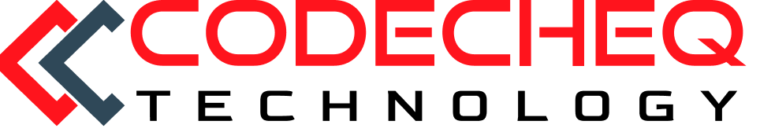

  
   
  <h1>Codecheq</h1>
  
Your go-to source for cutting-edge software solutions

   

---

## 🚀 About Us

Welcome to Codecheq's GitHub profile! We are a forward-thinking software company dedicated to providing innovative solutions for businesses worldwide. From custom web applications to mobile app development and beyond, our team of experts is committed to delivering high-quality, scalable software products tailored to meet your unique needs.

## 📂 Our Projects

Explore our repositories to discover a wide range of projects showcasing our expertise in various technologies and domains. Whether you're looking for a robust e-commerce solution, a user-friendly mobile app, or a powerful data analytics platform, we've got you covered. Check out our projects, contribute, and let's build something amazing together.

### Featured Projects:
- [Project 1](https://github.com/Codecheq/project-1): Description of Project 1.
- [Project 2](https://github.com/Codecheq/project-2): Description of Project 2.
- [Project 3](https://github.com/Codecheq/project-3): Description of Project 3.

## 📩 Get in Touch

Got questions or interested in collaborating with us? We'd love to hear from you! Reach out to us via [email](mailto:contact@codecheq.com) or visit our website [codecheq.com](https://www.codecheq.com) for more information. Let's turn your ideas into reality!

## 🔗 Connect with Us

Stay updated with our latest projects, news, and insights by following us on social media:

- [Twitter](https://twitter.com/codecheq)
- [LinkedIn](https://www.linkedin.com/company/codecheq)
- [Facebook](https://www.facebook.com/codecheq)

## 📄 License

All our projects are open-source and available under the [MIT License](LICENSE.md). Feel free to use, modify, and distribute them according to the terms of the license.

## 🙏 Thank You

Thank you for visiting our GitHub profile! We're excited to collaborate with you and help bring your ideas to life. Let's innovate together!
